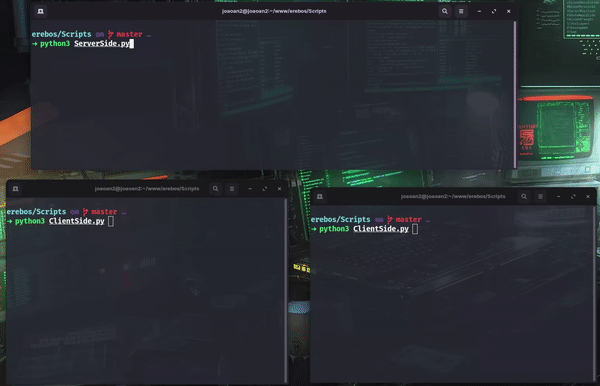

# 💻 Érebos

Projeto desenvolvido para o trabalho referente ao 4° bimestre da matéria de Sistemas Operacionais

## 📐 Curso técnico de Informática UTFPR

Comunicação entre dois ou mais client - Server, utilizando a biblioteca socket

###  📚 Bibliotecas utilizadas

- socket

- threading

- time

- random

- cryptography.fernet 

 🧩 Utilize o comando no CMD Windows: `pip install cryptography`

 🐧🍎 Ou no terminal Linux/MacOS: `pip3 install cryptography`

## Trabalho

Trabalho desenvolvido em Python 🐍

Bate-papo utilizando socket como conexão entre os usuários, mensagens criptografadas pela biblioteca `cryptography.fernet`

## 👾 Projeto funcionando

Exemplo das mensagens passando pelo servidor e sendo distribuídas na conversa entre dois usuários. Ao final os usuários se desconectam utilizando `/exit`.

    

## 📝 Mit license

Mais detalhes: [License](/LICENSE)

---

Feito pelo aluno João Augusto do Nascimento ❤

